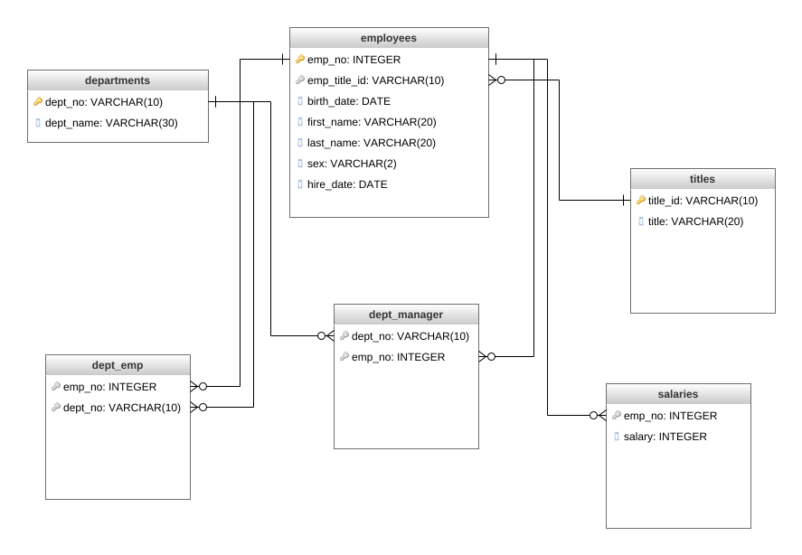
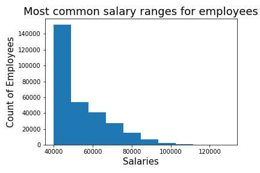
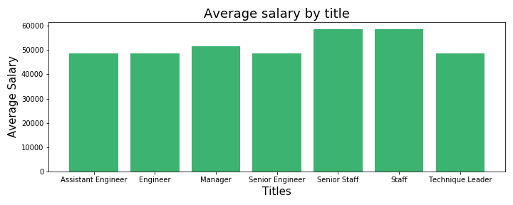

# sql-challenge

## Import csv files in the following order:
1. departments
2. titles
3. employees
4. dept_emp
5. dept_manager
6. salaries

## ERD 

## Histogram of Salary Ranges

## Bar chart of Average Salary by Title

